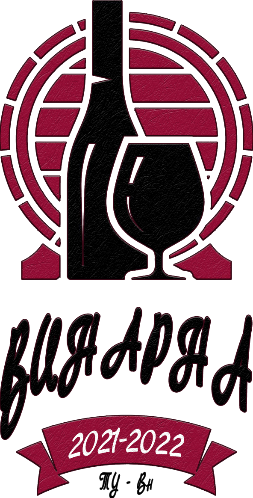

[![Contributors][contributors-shield]][contributors-url]
[![Forks][forks-shield]][forks-url]
[![Stargazers][stars-shield]][stars-url]
[![Issues][issues-shield]][issues-url]
[![MIT License][license-shield]][license-url]

<!-- PROJECT LOGO -->
 

  

<h3 align="center">Vinarna</h3>

  

    OOP2 Course Work, 2021/2022, TU Varna
     
    <a href="https://github.com/SimeonStoynev/vinarna/issues">Report Bug</a>
    ·
    <a href="https://github.com/SimeonStoynev/vinarna/issues">Request Feature</a>
  

<!-- TABLE OF CONTENTS -->

  
Съдържание

  <ol>
    <li><a href="#за-проекта">За проекта</a></li>
    <li><a href="#roadmap">Roadmap</a></li>
  </ol>

## За проекта

Това е университетски проект по дисциплина ООП2.

(<a href="#top">нагоре</a>)

## Roadmap
- [x] Инициализация на проекта
- [x] Създаване на оператори от администратор
- [x] Създаване на домакини от администратор
- [x] Регистриране на сорт грозде и количеството му в склада(сортовете се делят на две категории - бели и черни);
- [x] Дефиниране на количеството вино което може да се получи от килограм грозде от даден сорт;
- [x] Регистриране на видове и количество бутилки за бутилиране на вино(750, 375,  200 и 187ml);
- [x] Всеки тип вино се състои от един или няколко сорта и за направата му е необходимо определено количество от тях;
- [x] Дефиниране на необходимите количества грозде за производството на даден вид вино;
- [x] Бутилиране на виното в бутилки (бонус – системата автоматично да изчислява оптимално запълване на бутилки);
- [ ] Справики наличности на сортове грозде;
- [ ] Справики наличност на видове бутилки;
- [ ] Справики наличности на видовете бутилирани вина;
- [ ] Известия за критичен минимум и липса на даден сорт грозде;
- [ ] Известия за критичен минимум и липса на даден вид бутилки;

Вижте [open issues](https://github.com/SimeonStoynev/vinarna/issues) за пълен списък с предложени функционалности (& забелязани проблеми).

(<a href="#top">нагоре</a>)

[contributors-shield]: https://img.shields.io/github/contributors/SimeonStoynev/vinarna.svg?style=for-the-badge
[contributors-url]: https://github.com/SimeonStoynev/vinarna/graphs/contributors
[forks-shield]: https://img.shields.io/github/forks/SimeonStoynev/vinarna.svg?style=for-the-badge
[forks-url]: https://github.com/SimeonStoynev/vinarna/network/members
[stars-shield]: https://img.shields.io/github/stars/SimeonStoynev/vinarna.svg?style=for-the-badge
[stars-url]: https://github.com/SimeonStoynev/vinarna/stargazers
[issues-shield]: https://img.shields.io/github/issues/SimeonStoynev/vinarna.svg?style=for-the-badge
[issues-url]: https://github.com/SimeonStoynev/vinarna/issues
[license-shield]: https://img.shields.io/github/license/SimeonStoynev/vinarna.svg?style=for-the-badge
[license-url]: https://github.com/SimeonStoynev/vinarna/blob/master/LICENSE.txt